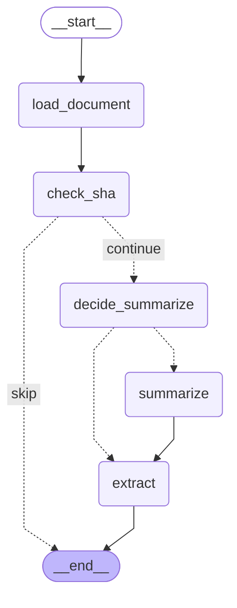
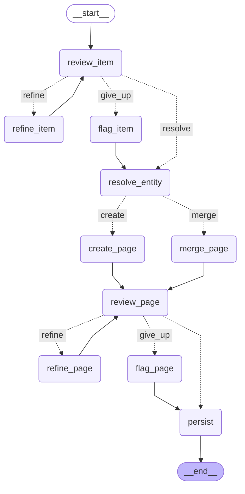

# Ingest graphs

Generated from the compiled LangGraph graphs, so they always match the code.
Regenerate after changing a graph:

```bash
uv run llm-wiki graph >> docs/graphs.md   # then replace the old diagrams
```

Two behaviours are worth reading off these diagrams:

- **`flag_item` / `flag_page`** are where a review that never passes lands. When
  the refine budget is spent the run takes that edge, sets `needs_review`, and
  rejoins the main line — the page is still written rather than dropped.
- **`[CURRENT]` substitution has no node of its own.** It happens inside
  `create_page` and `merge_page`, because it must run after the transaction
  assigns `reference_order` and before the text reaches the LLM. Splitting it out
  would hide that ordering constraint.

## Stage 1 — `doc_graph`



## Stage 2 — `item_graph`



