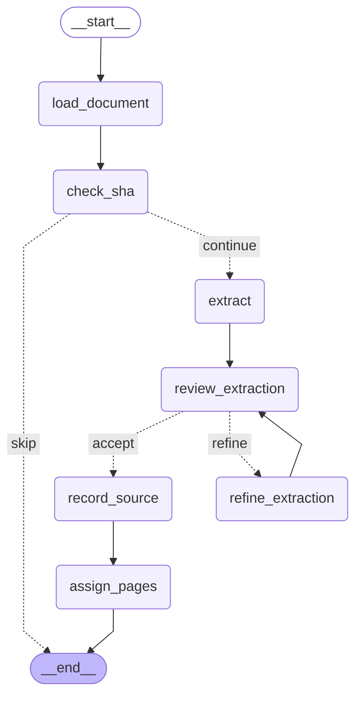
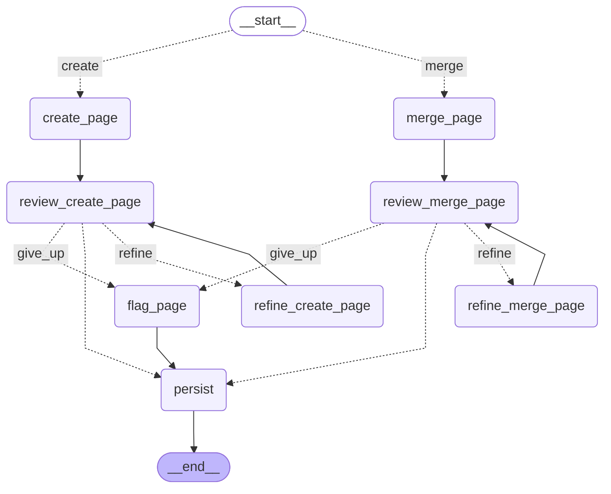

# Ingest graphs

Generated from the compiled LangGraph graphs, so they always match the code.
Regenerate after changing a graph:

```bash
uv run llm-wiki graph >> docs/graphs.md   # then replace the old diagrams
```

Two behaviours are worth reading off these diagrams:

- **Extraction quality is settled in stage 1.** `review_extraction` /
  `refine_extraction` check the whole item list against the source — recall,
  precision, type, aliases — and rebuild it, dropping spurious items outright.
  The list reaching stage 2 is already vetted, so stage 2 has no per-item review.
- **`assign_pages` is the serial bottleneck, and the only one.** It answers "does
  this page already exist?" for every item, against the database *and* against
  the pages earlier items in the same document have already claimed. Because it
  hands stage 2 one assignment per distinct page, stage 2 has no resolution node
  at all — `__start__` branches straight on a decision already made — and the
  pipeline runs several of those graphs concurrently.
- **`flag_page`** is where a page review that never passes lands. When the refine
  budget is spent the run takes that edge, sets `needs_review`, and rejoins the
  main line — the page is still written rather than dropped.
- **Citations carry no placeholder.** Every fact in an item's description comes
  from one source, so the reference number is uniform and unknown until the
  source is linked. `create_page` / `merge_page` are told the number and attach
  it directly; there is no marker to substitute later.

## Stage 1 — `doc_graph`



## Stage 2 — `item_graph`


